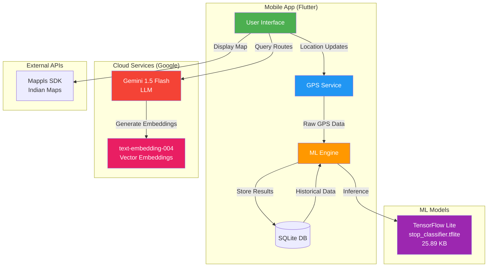
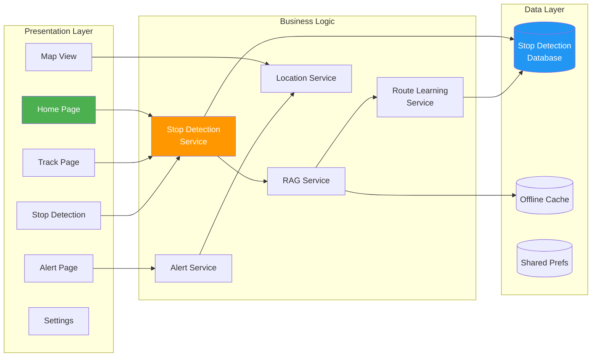
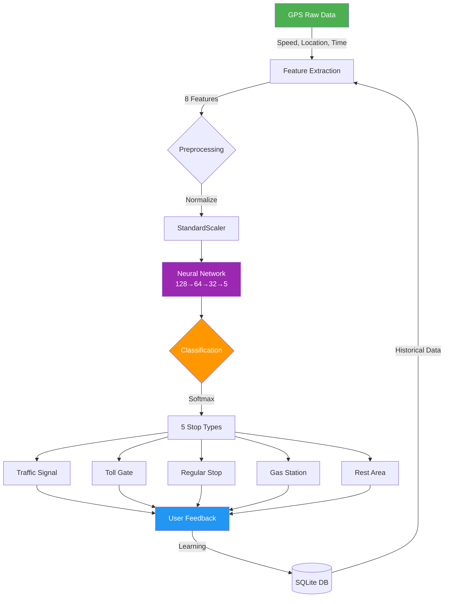
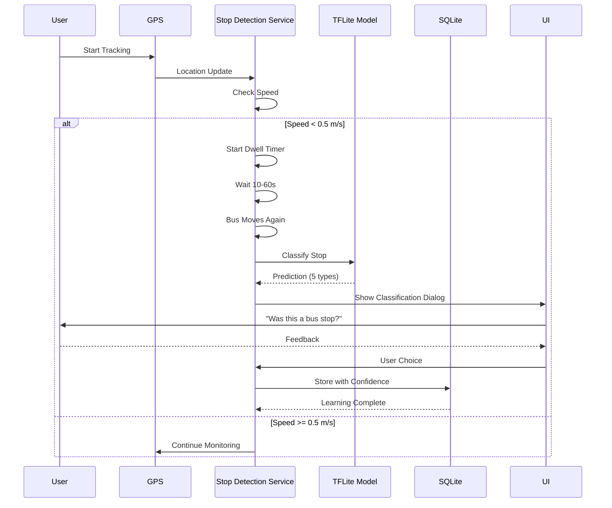
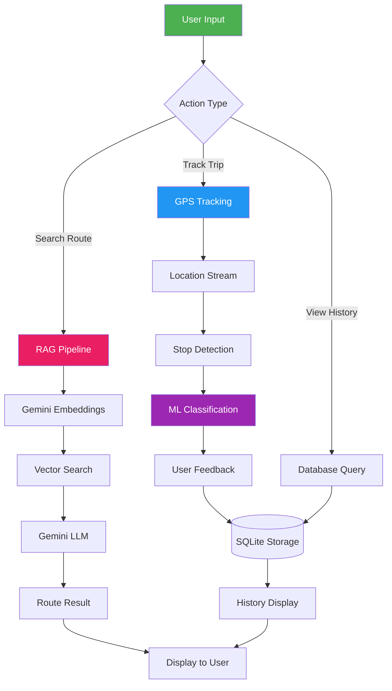
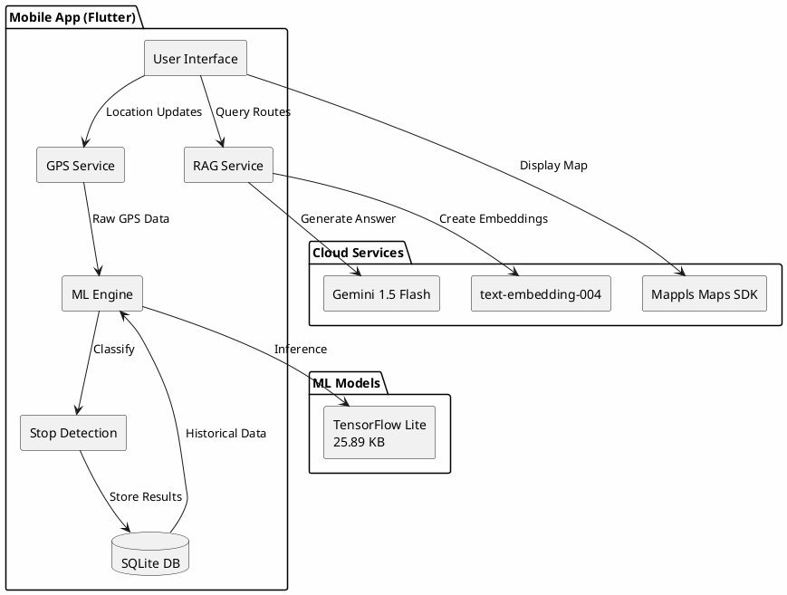
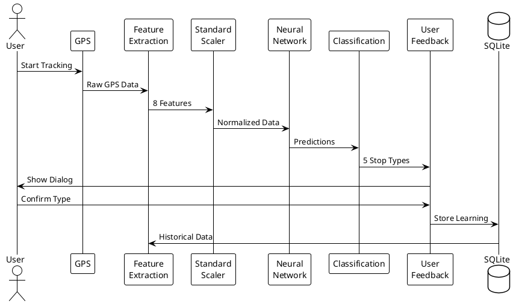

# 🏗️ Travion System Design

Complete system architecture diagrams for the TravelAI/Travion project.

---

## 📐 1. Overall System Architecture

### Mermaid Diagram (Renders on GitHub)



### ASCII Diagram

```
┌─────────────────────────────────────────────────────────────────┐
│                    TRAVION SYSTEM ARCHITECTURE                  │
└─────────────────────────────────────────────────────────────────┘

┌──────────────────────┐           ┌──────────────────────┐
│   Mobile App Layer   │           │   Cloud Services     │
│     (Flutter)        │◄─────────►│    (Google AI)       │
├──────────────────────┤           ├──────────────────────┤
│                      │           │                      │
│  ┌────────────────┐  │           │  ┌────────────────┐ │
│  │ User Interface │  │           │  │ Gemini 1.5     │ │
│  └────────┬───────┘  │           │  │ Flash (LLM)    │ │
│           │          │           │  └────────────────┘ │
│  ┌────────▼───────┐  │           │                      │
│  │  GPS Service   │  │           │  ┌────────────────┐ │
│  └────────┬───────┘  │           │  │ text-embedding │ │
│           │          │           │  │ -004 (Vector)  │ │
│  ┌────────▼───────┐  │           │  └────────────────┘ │
│  │   ML Engine    │◄─┼───────────┼──────────┐          │
│  └────────┬───────┘  │           │          │          │
│           │          │           └──────────┼──────────┘
│  ┌────────▼───────┐  │                      │
│  │  TFLite Model  │  │           ┌──────────▼──────────┐
│  │  (25.89 KB)    │  │           │   Mappls Maps SDK   │
│  └────────┬───────┘  │           │   (Indian Maps)     │
│           │          │           └─────────────────────┘
│  ┌────────▼───────┐  │
│  │  SQLite DB     │  │
│  │ (Local Store)  │  │
│  └────────────────┘  │
└──────────────────────┘
```

---

## 📱 2. Mobile App Architecture

### Mermaid Diagram



### ASCII Diagram

```
┌─────────────────────────────────────────────────────────────┐
│               FLUTTER APP ARCHITECTURE (MVVM)               │
└─────────────────────────────────────────────────────────────┘

┌─────────────────── UI Layer ───────────────────┐
│                                                 │
│  ┌──────┐  ┌──────┐  ┌──────┐  ┌──────┐      │
│  │ Home │  │ Map  │  │Track │  │Alert │      │
│  └──┬───┘  └──┬───┘  └──┬───┘  └──┬───┘      │
└─────┼─────────┼─────────┼─────────┼───────────┘
      │         │         │         │
┌─────▼─────────▼─────────▼─────────▼───────────┐
│            Business Logic Layer                │
├────────────────────────────────────────────────┤
│                                                 │
│  ┌─────────────────┐  ┌─────────────────┐     │
│  │ Stop Detection  │  │   RAG Service   │     │
│  │    Service      │◄─┤  (Route Search) │     │
│  └────────┬────────┘  └────────┬────────┘     │
│           │                    │               │
│  ┌────────▼────────┐  ┌────────▼────────┐     │
│  │ Route Learning  │  │ Alert Service   │     │
│  │    Service      │  │  (Proximity)    │     │
│  └────────┬────────┘  └────────┬────────┘     │
└───────────┼────────────────────┼───────────────┘
            │                    │
┌───────────▼────────────────────▼───────────────┐
│              Data Layer                         │
├─────────────────────────────────────────────────┤
│                                                 │
│  ┌──────────┐  ┌──────────┐  ┌──────────┐     │
│  │  SQLite  │  │  Cache   │  │  Shared  │     │
│  │    DB    │  │ (Assets) │  │  Prefs   │     │
│  └──────────┘  └──────────┘  └──────────┘     │
└─────────────────────────────────────────────────┘
```

---

## 🤖 3. ML Pipeline Architecture

### Mermaid Diagram



### ASCII Diagram

```
┌─────────────────────────────────────────────────────────────┐
│                  ML CLASSIFICATION PIPELINE                 │
└─────────────────────────────────────────────────────────────┘

GPS Data ──────┐
               │
┌──────────────▼──────────────┐
│   Feature Extraction        │
│  • dwell_time               │
│  • speed_before             │
│  • heading                  │
│  • visit_count              │
│  • hour                     │
│  • day_of_week              │
│  • latitude                 │
│  • longitude                │
└──────────────┬──────────────┘
               │
┌──────────────▼──────────────┐
│   StandardScaler            │
│   (Normalization)           │
└──────────────┬──────────────┘
               │
┌──────────────▼──────────────┐
│   Neural Network            │
│   ┌─────────────────┐       │
│   │ Input: 8        │       │
│   └────────┬────────┘       │
│   ┌────────▼────────┐       │
│   │ Dense: 128      │       │
│   │ Dropout: 0.3    │       │
│   └────────┬────────┘       │
│   ┌────────▼────────┐       │
│   │ Dense: 64       │       │
│   │ Dropout: 0.2    │       │
│   └────────┬────────┘       │
│   ┌────────▼────────┐       │
│   │ Dense: 32       │       │
│   │ Dropout: 0.2    │       │
│   └────────┬────────┘       │
│   ┌────────▼────────┐       │
│   │ Output: 5       │       │
│   │ Softmax         │       │
│   └─────────────────┘       │
└──────────────┬──────────────┘
               │
┌──────────────▼──────────────┐
│      Classification         │
│  ┌───────────────────────┐  │
│  │ 0: Traffic Signal     │  │
│  │ 1: Toll Gate          │  │
│  │ 2: Regular Stop       │  │
│  │ 3: Gas Station        │  │
│  │ 4: Rest Area          │  │
│  └───────────────────────┘  │
└──────────────┬──────────────┘
               │
┌──────────────▼──────────────┐
│     User Feedback           │
│   (Crowdsourced Learning)   │
└──────────────┬──────────────┘
               │
        ┌──────▼──────┐
        │  SQLite DB  │
        │  (Learning) │
        └─────────────┘
```

---

## 🔍 4. RAG System Architecture

### Mermaid Diagram

```mermaid
graph LR
    A[User Query:<br/>"Mangalore to Karkala"] --> B[Gemini<br/>text-embedding-004]
    B --> C[384D Vector]
    
    D[(Knowledge Base<br/>Route Entries)] --> E[Pre-computed<br/>Embeddings]
    E --> F[Vector Store]
    
    C --> G{Similarity Search}
    F --> G
    
    G -->|Cosine Similarity<br/>70% weight| H[Top Matches]
    
    A -->|Keywords| I[Keyword Match<br/>30% weight]
    D --> I
    
    H --> J[Combined Score]
    I --> J
    
    J --> K[Best Route]
    K --> L[Gemini 1.5 Flash<br/>Response Generation]
    L --> M[Natural Language<br/>Answer]
    
    style A fill:#4CAF50,color:#fff
    style B fill:#E91E63,color:#fff
    style G fill:#FF9800,color:#fff
    style L fill:#F44336,color:#fff
```

### ASCII Diagram

```
┌─────────────────────────────────────────────────────────────┐
│              RAG (RETRIEVAL-AUGMENTED GENERATION)           │
└─────────────────────────────────────────────────────────────┘

User Query: "Mangalore to Karkala bus"
        │
        ▼
┌───────────────────┐
│ Query Processing  │
└────────┬──────────┘
         │
    ┌────┴─────┐
    │          │
    ▼          ▼
┌─────────┐  ┌──────────────┐
│Embedding│  │Keyword       │
│ (70%)   │  │Extraction    │
└────┬────┘  │(30%)         │
     │       └──────┬───────┘
     │              │
     ▼              ▼
┌─────────────────────────────┐
│   Vector Similarity Search  │
│                             │
│  ┌───────────────────────┐  │
│  │ Knowledge Base        │  │
│  │ ┌─────────────────┐   │  │
│  │ │ Route 1: EMB    │   │  │
│  │ │ Route 2: EMB    │   │  │
│  │ │ Route 3: EMB    │   │  │
│  │ │    ...          │   │  │
│  │ └─────────────────┘   │  │
│  └───────────────────────┘  │
└──────────┬──────────────────┘
           │
           ▼
┌─────────────────────┐
│  Combined Scoring   │
│  • Cosine: 70%      │
│  • Keyword: 30%     │
└──────────┬──────────┘
           │
           ▼
┌─────────────────────┐
│   Top 3 Matches     │
└──────────┬──────────┘
           │
           ▼
┌─────────────────────┐
│  Gemini 1.5 Flash   │
│  (Answer Generator) │
└──────────┬──────────┘
           │
           ▼
    Natural Language
       Response
```

---

## 🚦 5. Stop Detection Flow

### Mermaid Diagram



### ASCII Diagram

```
┌─────────────────────────────────────────────────────────────┐
│              STOP DETECTION WORKFLOW                        │
└─────────────────────────────────────────────────────────────┘

    USER STARTS TRACKING
            │
            ▼
    ┌───────────────┐
    │  GPS Service  │
    │  (5m filter)  │
    └───────┬───────┘
            │ Location Update
            ▼
    ┌───────────────────┐
    │  Check Speed      │
    │  Threshold:       │
    │  < 0.5 m/s        │
    └─────────┬─────────┘
              │
        ┌─────┴─────┐
        │           │
    MOVING      STOPPED
        │           │
        │           ▼
        │   ┌───────────────┐
        │   │ Start Dwell   │
        │   │    Timer      │
        │   └───────┬───────┘
        │           │
        │           ▼
        │   ┌───────────────┐
        │   │ Wait 10-60s   │
        │   │ (Min/Max)     │
        │   └───────┬───────┘
        │           │
        │           ▼
        │   ┌───────────────┐
        │   │ Bus Moves?    │
        │   └───────┬───────┘
        │           │ YES
        │           ▼
        │   ┌─────────────────────┐
        │   │  Extract Features   │
        │   │  • dwell_time       │
        │   │  • speed_before     │
        │   │  • location         │
        │   │  • time_of_day      │
        │   └──────────┬──────────┘
        │              │
        │              ▼
        │   ┌─────────────────────┐
        │   │  TFLite Inference   │
        │   │  Neural Network     │
        │   └──────────┬──────────┘
        │              │
        │              ▼
        │   ┌─────────────────────┐
        │   │  Classification     │
        │   │  ┌───────────────┐  │
        │   │  │Traffic Signal │  │
        │   │  │Toll Gate      │  │
        │   │  │Regular Stop   │  │
        │   │  │Gas Station    │  │
        │   │  │Rest Area      │  │
        │   │  └───────────────┘  │
        │   └──────────┬──────────┘
        │              │
        │              ▼
        │   ┌─────────────────────┐
        │   │  Show Dialog to     │
        │   │  User for Feedback  │
        │   └──────────┬──────────┘
        │              │
        │              ▼
        │      ┌──────────────┐
        │      │ User Confirms│
        │      │  Stop Type   │
        │      └──────┬───────┘
        │             │
        │             ▼
        │   ┌──────────────────┐
        │   │  Update SQLite   │
        │   │  • Confidence++  │
        │   │  • Learn Pattern │
        │   └──────────────────┘
        │
        └──► Continue Monitoring
```

---

## 🌐 6. Data Flow Diagram

### Mermaid Diagram



---

## 🔧 7. Technology Stack

```
┌─────────────────────────────────────────────────────────────┐
│                    TECHNOLOGY STACK                         │
└─────────────────────────────────────────────────────────────┘

┌──────────────────┐  ┌──────────────────┐  ┌──────────────────┐
│   Frontend       │  │   Backend        │  │   ML/AI          │
├──────────────────┤  ├──────────────────┤  ├──────────────────┤
│ • Flutter 3.x    │  │ • Dart           │  │ • TensorFlow     │
│ • Material UI    │  │ • SQLite         │  │ • TFLite         │
│ • Mappls SDK     │  │ • SharedPrefs    │  │ • Scikit-learn   │
│                  │  │                  │  │ • Pandas/NumPy   │
└──────────────────┘  └──────────────────┘  └──────────────────┘

┌──────────────────┐  ┌──────────────────┐  ┌──────────────────┐
│   Cloud Services │  │   Sensors        │  │   Dev Tools      │
├──────────────────┤  ├──────────────────┤  ├──────────────────┤
│ • Gemini 1.5     │  │ • GPS            │  │ • VS Code        │
│ • text-embed-004 │  │ • Accelerometer  │  │ • Git/GitHub     │
│ • Google AI SDK  │  │ • Gyroscope      │  │ • Flutter DevTools│
│                  │  │                  │  │ • Python         │
└──────────────────┘  └──────────────────┘  └──────────────────┘
```

---

## 🎨 8. PlantUML Code (use plantuml.com)





---

## 🌍 9. Online Diagram Tools

### **Draw.io / diagrams.net** (FREE)
- URL: https://app.diagrams.net/
- Import this XML:

```xml
<mxfile host="app.diagrams.net">
  <diagram name="Travion">
    <mxGraphModel>
      <root>
        <mxCell id="0"/>
        <mxCell id="1" parent="0"/>
        <mxCell id="2" value="Flutter App" style="rounded=1;whiteSpace=wrap;html=1;fillColor=#4CAF50;strokeColor=#2E7D32;fontColor=#FFFFFF;" vertex="1" parent="1">
          <mxGeometry x="40" y="40" width="120" height="60" as="geometry"/>
        </mxCell>
        <mxCell id="3" value="GPS Service" style="rounded=1;whiteSpace=wrap;html=1;fillColor=#2196F3;strokeColor=#1565C0;fontColor=#FFFFFF;" vertex="1" parent="1">
          <mxGeometry x="40" y="140" width="120" height="60" as="geometry"/>
        </mxCell>
        <mxCell id="4" value="ML Engine" style="rounded=1;whiteSpace=wrap;html=1;fillColor=#FF9800;strokeColor=#E65100;fontColor=#FFFFFF;" vertex="1" parent="1">
          <mxGeometry x="40" y="240" width="120" height="60" as="geometry"/>
        </mxCell>
        <mxCell id="5" value="Gemini AI" style="rounded=1;whiteSpace=wrap;html=1;fillColor=#F44336;strokeColor=#C62828;fontColor=#FFFFFF;" vertex="1" parent="1">
          <mxGeometry x="240" y="140" width="120" height="60" as="geometry"/>
        </mxCell>
      </root>
    </mxGraphModel>
  </diagram>
</mxfile>
```

### **Excalidraw** (FREE)
- URL: https://excalidraw.com/
- Hand-drawn style diagrams
- Export as PNG/SVG

### **Lucidchart** (FREE tier)
- URL: https://www.lucidchart.com/
- Professional diagrams
- Up to 3 docs free

### **Mermaid Live Editor** (FREE)
- URL: https://mermaid.live/
- Paste the Mermaid code from above
- Export as PNG/SVG

---

## 📊 Quick Reference

| Diagram Type | Best For | Tool |
|--------------|----------|------|
| **Mermaid** | GitHub READMEs | Built-in GitHub |
| **PlantUML** | Technical docs | plantuml.com |
| **ASCII** | Simple text docs | Any editor |
| **Draw.io** | Professional presentations | diagrams.net |
| **Excalidraw** | Quick sketches | excalidraw.com |

---

## 🚀 How to Use

### **1. GitHub (Mermaid)**
Just paste the Mermaid code blocks into your `README.md` - GitHub renders them automatically!

### **2. PlantUML Online**
1. Go to http://www.plantuml.com/plantuml/uml/
2. Paste the PlantUML code
3. Download as PNG/SVG

### **3. Draw.io**
1. Go to https://app.diagrams.net/
2. File → Import from → Paste the XML
3. Edit and export

### **4. VS Code Extension**
Install "Markdown Preview Mermaid Support" to preview Mermaid diagrams locally.

---

## 📁 Files Generated

All diagrams are embedded in this file. You can:
- ✅ Copy Mermaid code to GitHub
- ✅ Copy PlantUML to plantuml.com
- ✅ View ASCII diagrams anywhere
- ✅ Use Draw.io XML for editing

---

**Generated for Travion Project - TravelAI Bus Stop Detection System** 🚌
